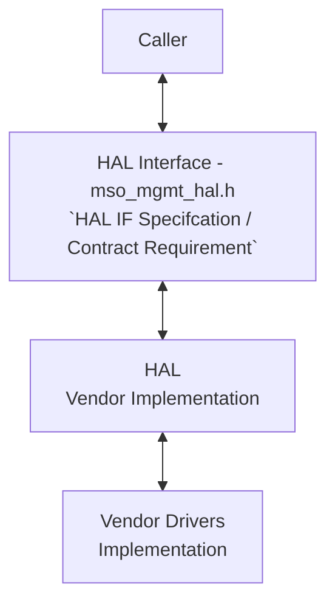
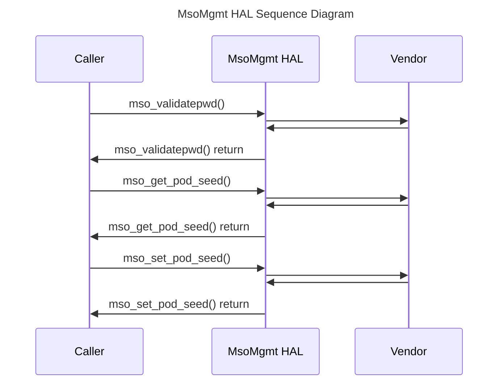

# MsoMgmt HAL Documentation

## Acronyms

- `HAL` \- Hardware Abstraction Layer
- `RDK-B` \- Reference Design Kit for Broadband Devices
- `OEM` \- Original Equipment Manufacture
- `API` \- Application Programming Interface
- `MSO` \- Multiple System Operator
- `WAN` \- Wide Area Network
- `LAN` \- Local Area Network
- `DHCP` \- Dynamic Host Configuration Protocol
- `DNS` \- Domain Name System
- `TR-069` \- Technical Report 069 (CWMP - CPE WAN Management Protocol)
- `RPC` \- Remote Procedure Call
- `DS` \- DOCSIS Specifications (Inferred from context)
- `MTA` \- Media Terminal Adapter

## Description

The MSO Management HAL (Hardware Abstraction Layer) module provides a standardized interface for managing and interacting with DOCSIS (Data Over Cable Service Interface Specification) devices within a Multiple System Operator (MSO) environment. It acts as a bridge between higher-level management applications and the underlying cable modem termination system (CMTS) or other DOCSIS equipment.

### Key functionalities of the MSO Management HAL include

- **Device Management:** Enables operations like provisioning, configuration, rebooting, and factory resetting of DOCSIS devices.
- **Data Model Access:** Provides mechanisms to read and modify parameters within the device's data model, which stores information about its configuration, capabilities, and operational state.
- **Operational Control:** Allows for control over various operational aspects of the device, such as network connectivity, diagnostics, and firmware upgrades.
- **Event Notifications:** Facilitates the reception of asynchronous notifications about important events or changes in the device's state.
- **Security:** Supports security-related functions like encryption and authentication for secure communication between the management application and the DOCSIS device.

By abstracting the underlying complexities of different DOCSIS devices, this HAL simplifies the development and maintenance of management applications, making it easier to control and monitor large-scale deployments of cable modems and other DOCSIS equipment in an MSO network.

The below diagram describes the high-level software architecture of the MsoMgmt HAL module stack.

## Component Runtime Execution Requirements

### Initialization and Startup

The MsoMgmt HAL client module does not have explicit dependencies on other APIs.

### Important Note for Implementers

- Third-party vendors must implement this HAL according to their system's specific requirements.
- The interface is designed to block execution if the necessary hardware is not yet ready, ensuring proper initialization before proceeding.

## Threading Model

There is no requirement to make this interface thread safe.

Any module that invokes the API should ensure calls are made in a thread-safe manner.

Vendors may implement internal threading and event mechanisms to meet their operational requirements. These mechanisms must be designed to ensure thread safety when interacting with HAL interface. Proper cleanup of allocated resources (e.g., memory, file handles, threads) is mandatory when the vendor software terminates or closes its connection to the HAL.

## Process Model

All APIs are expected to be called from multiple processes. Due to this concurrent access, vendors must implement protection mechanisms within their API implementations to handle multiple processes calling the same API simultaneously. This is crucial to ensure data integrity, prevent race conditions, and maintain the overall stability and reliability of the system.

## Memory Model

### Caller Responsibilities

- Manage memory passed to specific functions as outlined in the API documentation. This includes allocation and deallocation to prevent leaks.

### Module Responsibilities

- Handle and deallocate memory used for its internal operations.
- Release all internally allocated memory upon closure to prevent leaks.

TODO: Define Memory Footprint Limit:

- Determine the maximum allowable memory footprint for the MsoMgmt HAL module.
- Consider factors like target hardware capabilities, available memory resources, and performance requirements.
- Express the limit in kilobytes (KB) for clarity.
- Document the memory footprint limit clearly in the header file and any relevant design specifications.

## Power Management Requirements

The HAL is not involved in any of the power management operations.

## Asynchronous Notification Model

There are no asynchronous notifications.

## Blocking calls

**Synchronous and Responsive:** All APIs within this module should operate synchronously and complete within a reasonable timeframe based on the complexity of the operation. Specific timeout values or guidelines may be documented for individual API calls.

**Timeout Handling:** To ensure resilience in cases of unresponsiveness, implement appropriate timeouts for API calls where failure due to lack of response is a possibility. Refer to the API documentation for recommended timeout values per function.

**Non-Blocking Requirement:** Given the single-threaded environment in which these APIs will be called, it is imperative that they do not block or suspend execution of the main thread. Implementations must avoid long-running operations or utilize asynchronous mechanisms where necessary to maintain responsiveness.

TODO (Performance & Timeouts):

- Define API Response Time Requirements:
  - For each MsoMgmt HAL API, specify the expected maximum response time under normal operating conditions.
  - Consider factors like underlying hardware/software latency, network conditions, and the complexity of the operation.
  - Reference relevant specifications (e.g., DOCSIS, RDK-B) to determine industry-standard or vendor-specific timeout values where applicable.
- Implement Timeout Mechanisms (if necessary):
  - If an API call can potentially hang or take an unreasonably long time, implement a timeout mechanism to prevent indefinite blocking.
  - Choose timeout values based on the defined response time requirements, allowing for a reasonable margin of error.
  - Document the default timeout values and any configuration options for each API.

## Internal Error Handling

**Synchronous Error Handling:** All APIs must return errors synchronously as a return value. This ensures immediate notification of errors to the caller.

**Internal Error Reporting:** The HAL is responsible for reporting any internal system errors (e.g., out-of-memory conditions) through the return value.

**Focus on Logging for Errors:** For system errors, the HAL should prioritize logging the error details for further investigation and resolution.

## Persistence Model

There is no requirement for HAL to persist any setting information.

## Nonfunctional requirements

Following non functional requirement should be supported by the component.

## Logging and debugging requirements

The component is required to record all errors and critical informative messages to aid in identifying, debugging, and understanding the functional flow of the system. Logging should be implemented using the syslog method, as it provides robust logging capabilities suited for system-level software. The use of `printf` is discouraged unless `syslog` is not available.

All HAL components must adhere to a consistent logging process. When logging is necessary, it should be performed into the `mso_vendor_hal.log` file, which is located in either the `/var/tmp/` or `/rdklogs/logs/` directories.

Logs must be categorized according to the following log levels, as defined by the Linux standard logging system, listed here in descending order of severity:

- **FATAL:** Critical conditions, typically indicating system crashes or severe failures that require immediate attention.
- **ERROR:** Non-fatal error conditions that nonetheless significantly impede normal operation.
- **WARNING:** Potentially harmful situations that do not yet represent errors.
- **NOTICE:** Important but not error-level events.
- **INFO:** General informational messages that highlight system operations.
- **DEBUG:** Detailed information typically useful only when diagnosing problems.
- **TRACE:** Very fine-grained logging to trace the internal flow of the system.

Each log entry should include a timestamp, the log level, and a message describing the event or condition. This standard format will facilitate easier parsing and analysis of log files across different vendors and components.

## Memory and performance requirements

**Client Module Responsibility:** The client module using the HAL is responsible for allocating and deallocating memory for any data structures required by the HAL's APIs. This includes structures passed as parameters to HAL functions and any buffers used to receive data from the HAL.

**Vendor Implementation Responsibility:** Third-party vendors, when implementing the HAL, may allocate memory internally for their specific operational needs. It is the vendor's sole responsibility to manage and deallocate this internally allocated memory.

## Quality Control

To ensure the highest quality and reliability, it is strongly recommended that third-party quality assurance tools like `Coverity`, `Black Duck`, and `Valgrind` be employed to thoroughly analyze the implementation. The goal is to detect and resolve potential issues such as memory leaks, memory corruption, or other defects before deployment.

Furthermore, both the HAL wrapper and any third-party software interacting with it must prioritize robust memory management practices. This includes meticulous allocation, deallocation, and error handling to guarantee a stable and leak-free operation.

## Licensing

The implementation is expected to released under the Apache License 2.0.

## Build Requirements

The source code should be capable of, but not be limited to, building under the Yocto distribution environment. The recipe should deliver a shared library named as `libhal_msomgmt.so`.

## Variability Management

The role of adjusting the interface, guided by versioning, rests solely within architecture requirements. Thereafter, vendors are obliged to align their implementation with a designated version of the interface. As per Service Level Agreement (SLA) terms, they may transition to newer versions based on demand needs.

Each API interface will be versioned using [Semantic Versioning 2.0.0](https://semver.org/), the vendor code will comply with a specific version of the interface.

## Platform or Product Customization

None

## Interface API Documentation

All HAL function prototypes and datatype definitions are available in `mso_mgmt_hal.h` file.

1. Components/Process must include `mso_mgmt_hal.h` to make use of MsoMgmt hal capabilities.
2. Components/Process should add linker dependency for `libhal_msomgmt.so`

## Theory of operation and key concepts

### Object Lifecycles

- **Creation/Initialization:** The `mso_mgmt_hal_init()` function initializes the HAL and returns a context handle `(mso_hal_handle_t)`. This handle is required for all subsequent operations.
- **Usage:** All operations on the MSO management interface are performed through the context handle obtained during initialization.
- **Destruction:** The `mso_mgmt_hal_deinit()` function releases resources associated with the HAL instance.
- **Unique Identifiers:** The `mso_hal_handle_t` acts as the unique identifier for each instance of the HAL module.

### Method Sequencing

- **Initialization is Mandatory:** The `mso_mgmt_hal_init()` function must be called before any other functions.
- **No Strict Ordering:** The specification does not enforce a strict order for most method calls, although certain operations may have logical dependencies. For example, you might need to establish a connection to the DOCSIS device before retrieving its information.
- **Parameter-Dependent Actions:** Methods that change device parameters must be called before actions that rely on those parameters.

### State-Dependent Behavior

- **Implicit State Model:** The MSO Management HAL has implicit states, such as initialized/uninitialized, connected/disconnected, and operational states as defined in the specification.
- **State-Aware Methods:** Some methods are only valid in certain states. For example, retrieving device information might require an established connection. The `mso_mgmt_hal_get_device_status()` function is specifically designed to retrieve the current device state.

## Sequence Diagram

